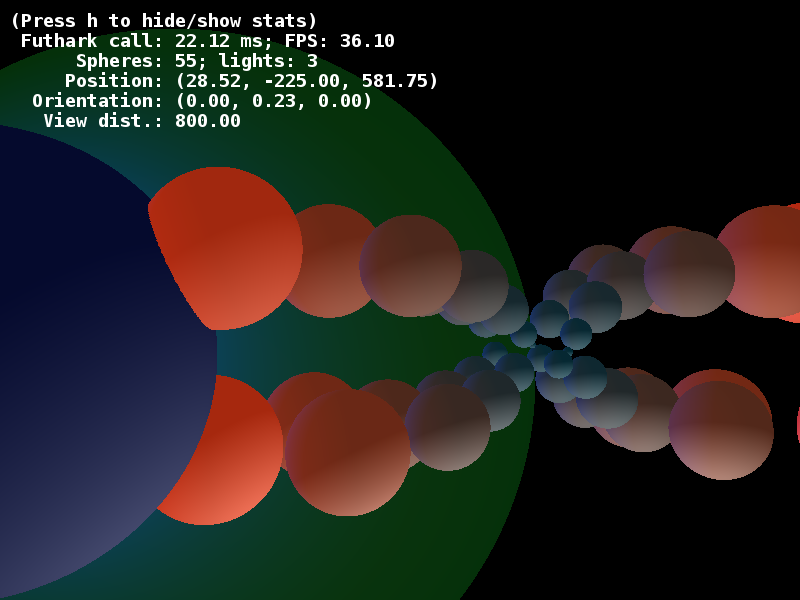

# fastcast

The screenshot is from a run on an NVIDIA GTX 960M.

This program raycasts spheres without reflections.  It uses a naive
(i.e, *wrong*) lighting model where light is never blocked by other
spheres.

fastcast tries to keep it simple, and is compiled into a single map
kernel over the screen dimensions.  There is also some bit fiddling just
for the fun of it.

Run `make run` to run the default demo.

## Controls

+ Up/Down: Move forwards/backwards
+ Left/Right: Turn left/right
+ PageUp/PageDown: Move upwards/downwards
+ Shift: Move four times faster
+ Minus/Plus: Adjust the view distance to the virtual screen
+ h: Toggle stats showing

## Requirements

  + Python 3 or Python 2.7
  + Futhark
  + PyOpenCL
  + NumPy
